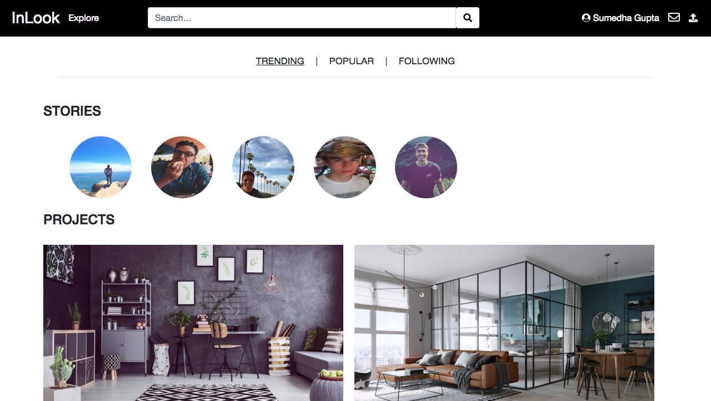
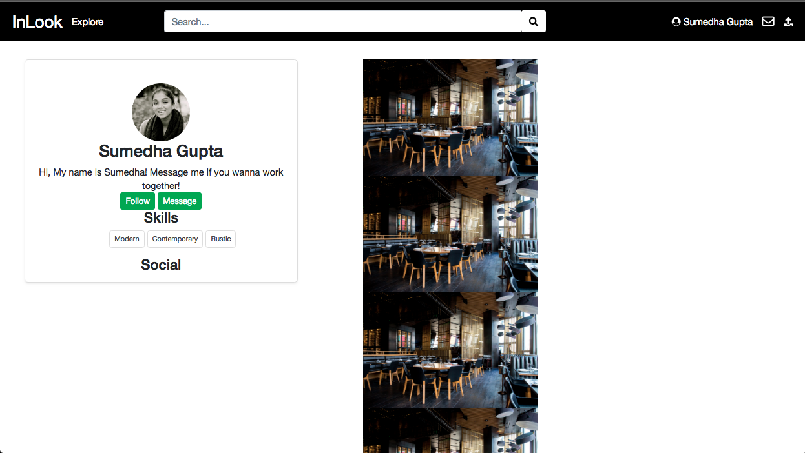

# Milestone #3

__Screenshots__
UI Skeleton webpages

__Screen #1 (App's home page)__

__Screen #2__

__Explanation__
For the home screen, we followed our paper prototype where we had a navigation bar that consisted of a search bar, profile link, messages, upload screen, and explore button. The home page consists of a mix of two functionalities from our paper prototypes. We have the stories function where designers can post stories of before/afters of their designs. There is also a feed users scroll through to view other work.
The profile page was kept the same as the paper prototype with the addition of social links in the profile details. Also, in terms of the layout, we changed the profile details to be as a side view profile card and the projects of the designers are to the right side of the page.
The upload page, also stayed the same with a large rectangle in the middle to drag pictures or browse pictures.
The messages page is also consistent with our paper prototype.
