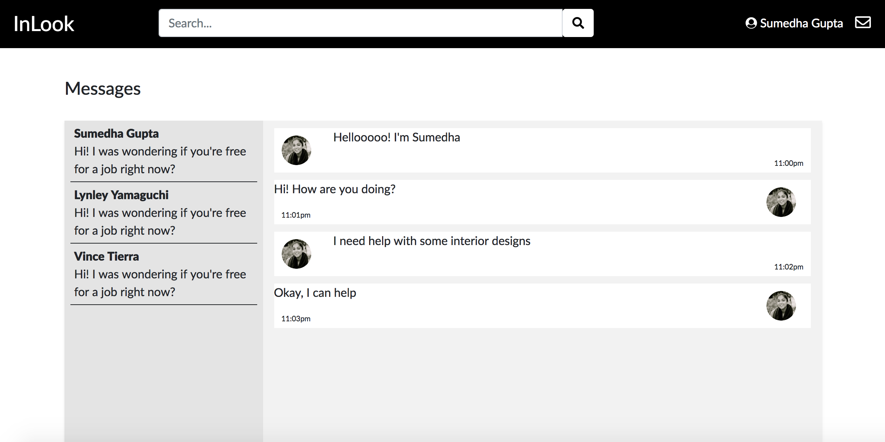
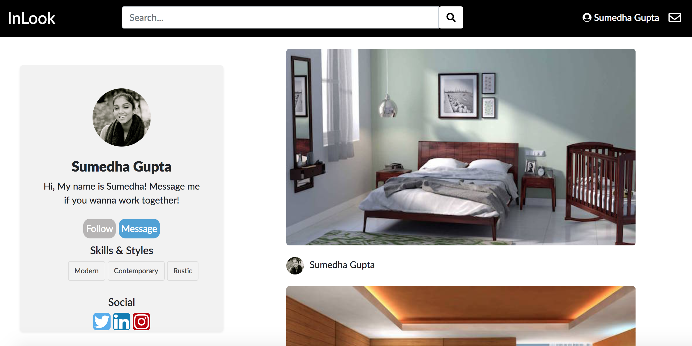
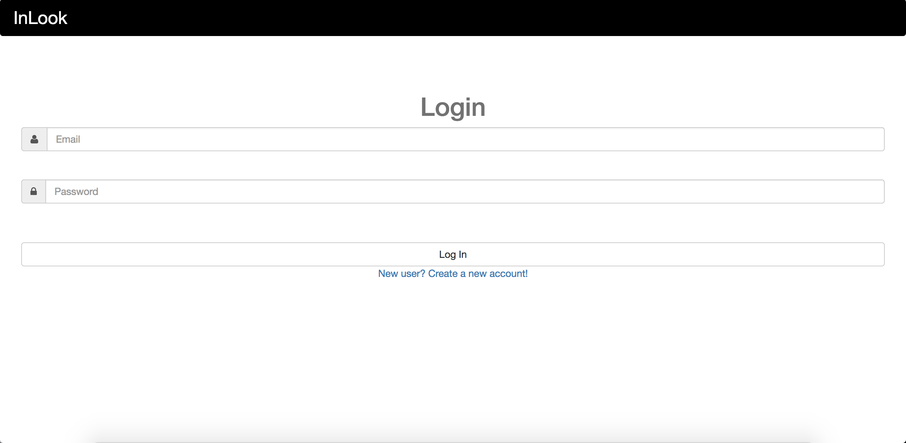
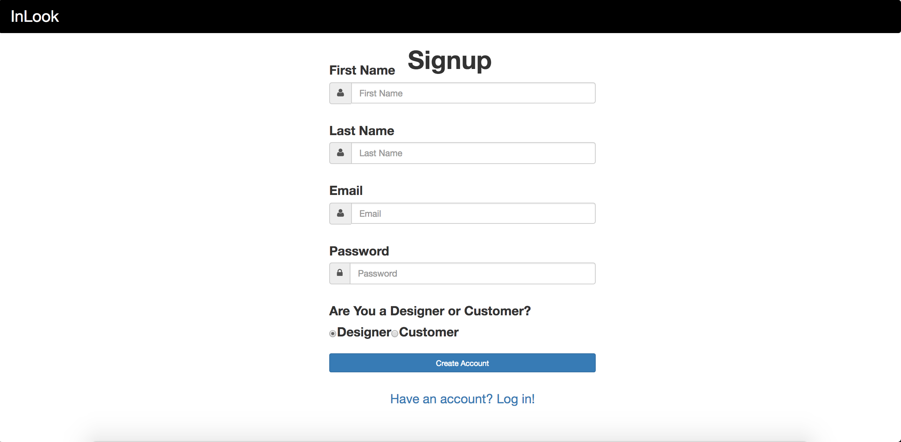

# Milestone 4

__Screenshots__
UI Skeleton Webpages

__Screen #1(Messages)__

__Screen #2(Profile)__

__Screen #3(Login)__

__Screen #4(Signup)__

__Explanation__
Our messages and profile page are significantly changed in terms of the layout. We made the messages page responsive using flexbox and we will continue to work on the layout a little more. The messages page currently shows a skeleton of the final product. It is an informal look similar to facebook messenger rather than Gmail.

Our profile page has no major changes since the last milestone. We cleaned it up a little more and made the pictures(projects) a little larger so users can scroll through the projects and get a good view of what the designer's work is like.

We added signup and login pages for users to create an account or login to their account. Now the homepage and profile page reflect the user that is logged in. 

__User Privacy__
Users of our site will agree to terms regarding their data when creating a profile. Agreeing to these terms will provide users consent to have the data that they voluntarily provide to be stored in our database. Access to their data will be protected by a username and password that they provide. We will attempt to secure our database by limiting access to the database file. We also have taken measures to authenticate users identity after a user logs in to ensure that they are only receiving data associated with their account. 

