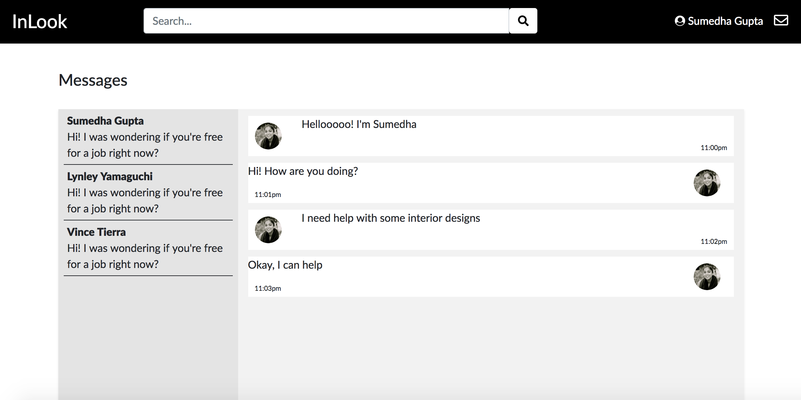

# Milestone 5

__Screenshots__
UI Skeleton Webpages

__Screen #1(Messages)__

__Screen #2(Profile)__

__Screen #3(Login)__

__Screen #4(Signup)__

__Improved Webpages__
Since the last deadline, we added a couple more UI elements to strengthen the web application's branding. We added a couple of stylistic elements to the navigation bar and added a logo to make the look of the webapp much more clear. In addition, we continued making the layouts of the messages page to be much nicer by using an API and bootstrap.

__User Actions__
1. Our first user action is being able to upload a photo to post and share with the other designers in the interior design community. When the photo gets uploaded, it gets added to the database, and gets posted on the home page and the user's profile page.

2. Our second user action is the messaging platform of our app. We are using websockets to build the chat app with socket.io. The chat app receives and sends messages without having to refresh the page.
