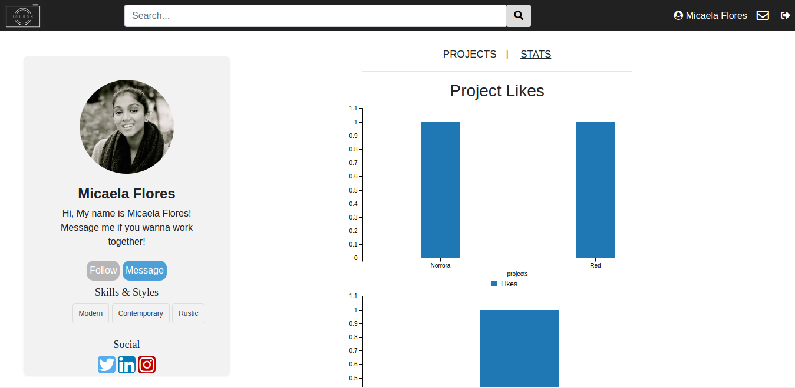

# Milestone 6

__Screenshots__
UI Skeleton Webpages

__Screen #1(Messages)__

__Screen #2(Home)__

__Screen #3(Profile)__

__Screen #4(Login)__

__Screen #5(Signup)__

__Screen #5(Stats)__

__Improved Webpages__
We have updated our UI with minor changes on every page. On our nav bar, we added a logo that says InLook which is the name of our web application. Next, we added the search feature which allows people to search for a particular project or user and the images corresponding to the search will be displayed to the user. Next, we added messaging. We used the send bird API for messaging instead of using web sockets. We are using our HTML and CSS template with the messaging feature. Also, we added the like feature to all the projects/images on the home feed. We have also implemented following so now users can follow another user through the app.

We have updated our UI with minor changes on every page. On our nav bar, we added a logo that says InLook which is the name of our web application. Next, we added the search feature which allows people to search for a particular project or user and the images corresponding to the search will be displayed to the user. Next, we added messaging. We used the send bird API for messaging instead of using web sockets. We are using our HTML and CSS template with the messaging feature. Also, we added the like feature to all the projects/images on the home feed. We have also implemented following so now users can follow another user through the app.
